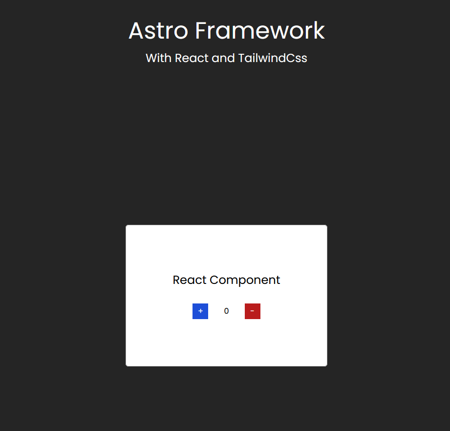

# Astro With React and Tailwind css



<br/>

### To run it

```
    npm install
    npm run dev
```

#### Build process

```
npm create astro@latest

```

Link to [astro.build](https://www.astro.build)

- added style.css in src folder

Link to [react-integration](https://docs.astro.build/en/guides/integrations-guide/react/)

I used `npx astro add react`

\*other package managers

```

##### Using NPM

npx astro add react

##### Using Yarn

yarn astro add react

##### Using PNPM

pnpm astro add react

```

Link to [tailwind-integration](https://docs.astro.build/en/guides/integrations-guide/tailwind/)

I used `npx astro add tailwind`

aslo in the style.css I added directives

```

@tailwind base;
@tailwind components;
@tailwind utilities;

```

```

```
